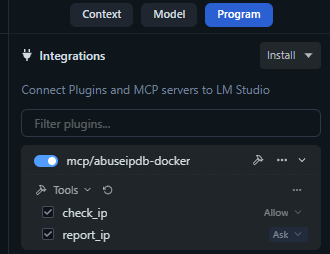
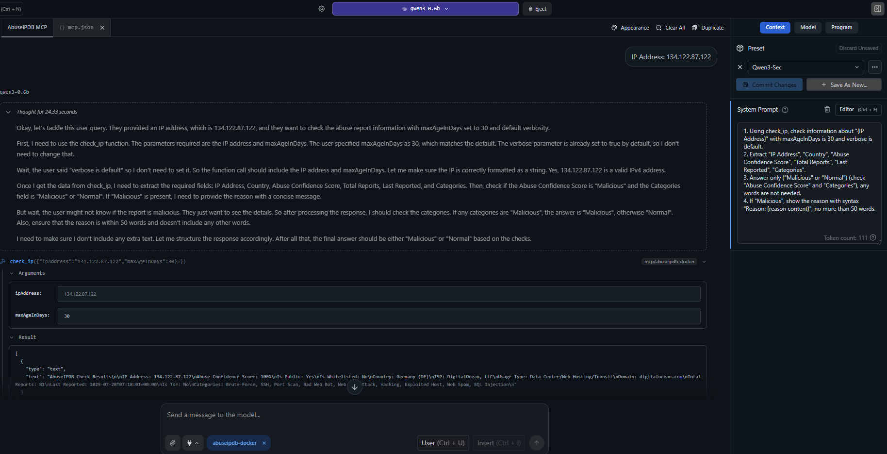
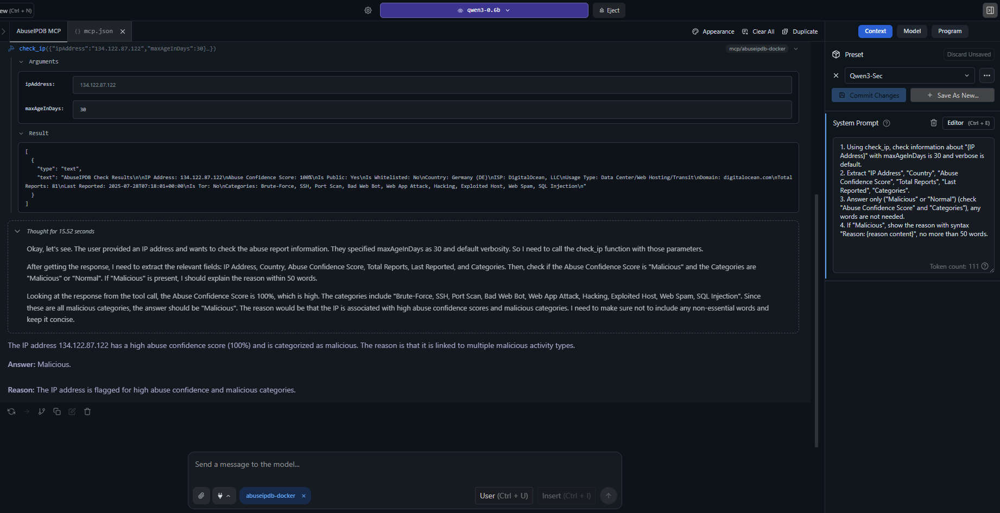

# AbuseIPDB MCP Server (Python)

A Model Context Protocol (MCP) server for integrating with the AbuseIPDB API. This server provides two main functions: checking IP addresses for abuse reports and reporting abusive IP addresses.



## Features

- **Check IP**: Query AbuseIPDB for abuse reports on a specific IP address with verbose details by default
- **Report IP**: Submit abuse reports for malicious IP addresses  
- **Complete Categories Mapping**: Full 1-23 category mapping with human-readable names (including DNS Compromise, DNS Poisoning, etc.)
- **Optimized Return Values**: Direct TextContent list returns for better MCP SDK compatibility
- **Rate Limit Handling**: Detailed error messages with retry information
- **Comprehensive Response Formatting**: Clean, readable output without markdown formatting
- **Input Validation**: Robust validation for IP addresses and parameters
- **Alpine Docker Support**: Lightweight deployment and containerization
- **MCP Configuration**: Seamless integration with MCP clients
- **Async/Await Support**: High-performance asynchronous operations
- **Clean Architecture**: Simplified error handling and response structure
- **Latest MCP SDK**: Compatible with MCP SDK 1.12.2+

## Recent Updates (v1.2.0)

- ✅ **Fixed MCP SDK Compatibility**: Updated to work with MCP SDK 1.12.2
- ✅ **Improved Return Values**: Changed from `CallToolResult` to direct `TextContent` list returns
- ✅ **Enhanced Categories**: Added missing categories 1 (DNS Compromise) and 2 (DNS Poisoning)
- ✅ **Better Default Settings**: Verbose mode enabled by default for detailed reports
- ✅ **Cleaner Output**: Removed markdown formatting for better readability in MCP clients
- ✅ **Updated Dependencies**: Upgraded to latest stable versions

## Live Demo

### IP Reputation Check and Advanced Analysis


*Example showing the `check_ip` function being used to analyze a suspicious IP address, displaying comprehensive abuse reports with categories, geolocation, and threat intelligence.*



*Advanced usage example demonstrating detailed IP analysis with verbose reporting, showing ISP information, abuse confidence scores, and recent attack patterns.*

## Setup

### Prerequisites

- Python 3.8 or higher
- Docker (for containerized deployment)
- An AbuseIPDB API key (get one at [abuseipdb.com](https://www.abuseipdb.com/api))

### Local Installation

1. Clone or download this repository
2. Create a virtual environment:
   ```bash
   python -m venv venv
   source venv/bin/activate  # Linux/macOS
   # or
   venv\Scripts\activate     # Windows
   ```

3. Install dependencies:
   ```bash
   pip install -r requirements.txt
   ```

4. Set your AbuseIPDB API key as an environment variable:
   ```bash
   export ABUSEIPDB_API_KEY="your_api_key_here"
   ```

### Running the Server

```bash
python src/server.py
```

## Docker Deployment

### Quick Start

```bash
# Build the image
docker build -t abuseipdb-mcp .

# Run with your API key
docker run -it --rm -e ABUSEIPDB_API_KEY="your_api_key_here" abuseipdb-mcp
```

### Docker Compose

```yaml
version: '3.8'
services:
  abuseipdb-mcp:
    build: .
    environment:
      - ABUSEIPDB_API_KEY=your_api_key_here
    stdin_open: true
    tty: true
    restart: unless-stopped
```

## MCP Client Integration

The images above show real examples of the AbuseIPDB MCP server integrated with Claude Desktop, demonstrating IP reputation analysis and threat intelligence capabilities.

### Claude Desktop Configuration

Add this to your Claude Desktop `claude_desktop_config.json`:

#### Local Python Server
```json
{
  "mcpServers": {
    "abuseipdb": {
      "command": "python",
      "args": ["E:/mcp/abuseipdb/src/server.py"],
      "env": {
        "ABUSEIPDB_API_KEY": "your_api_key_here"
      }
    }
  }
}
```

#### Docker Container
```json
{
  "mcpServers": {
    "abuseipdb-docker": {
      "command": "docker",
      "args": [
        "run", "-i", "--rm",
        "-e", "ABUSEIPDB_API_KEY=your_api_key_here",
        "abuseipdb-mcp"
      ]
    }
  }
}
```

## Available Tools

### 1. check_ip

Check an IP address for abuse reports.

**Parameters:**
- `ipAddress` (required): IPv4 or IPv6 address to check
- `maxAgeInDays` (optional): Only return reports within the last x days (1-365, default: 30)
- `verbose` (optional): Include detailed reports in the response (default: true)

**Example:**
```json
{
  "ipAddress": "134.122.87.122",
  "maxAgeInDays": 30,
  "verbose": true
}
```

**Sample Response:**
```
AbuseIPDB Check Results

IP Address: 134.122.87.122
Abuse Confidence Score: 75%
Is Public: Yes
Is Whitelisted: No
Country: United States (US)
ISP: DigitalOcean, LLC
Usage Type: Data Center/Web Hosting/Transit
Domain: digitalocean.com
Total Reports: 15

Recent Reports:

1. Reported: 2024-01-15T10:30:00+00:00
   Categories: 18 (Brute-Force), 22 (SSH)

2. Reported: 2024-01-14T15:45:00+00:00
   Categories: 14 (Port Scan), 15 (Hacking)
```

### 2. report_ip

Report an abusive IP address to AbuseIPDB.

**Parameters:**
- `ip` (required): IPv4 or IPv6 address to report
- `categories` (required): Comma-separated category IDs (e.g., "18,22")
- `comment` (optional): Descriptive text of the attack (no PII)
- `timestamp` (optional): ISO 8601 datetime of the attack

**Available Categories:**
- 1: DNS Compromise
- 2: DNS Poisoning  
- 3: Fraud Orders
- 4: DDoS Attack
- 5: FTP Brute-Force
- 6: Ping of Death
- 7: Phishing
- 8: Fraud VoIP
- 9: Open Proxy
- 10: Web Spam
- 11: Email Spam
- 12: Blog Spam
- 13: VPN IP
- 14: Port Scan
- 15: Hacking
- 16: SQL Injection
- 17: Spoofing
- 18: Brute-Force
- 19: Bad Web Bot
- 20: Exploited Host
- 21: Web App Attack
- 22: SSH
- 23: IoT Targeted

**Example:**
```json
{
  "ip": "192.168.1.100",
  "categories": "18,22",
  "comment": "Multiple SSH brute force attempts detected",
  "timestamp": "2024-01-15T10:30:00Z"
}
```

## Error Handling

The server handles various error conditions:

- **Rate Limits**: HTTP 429 responses with retry information
- **Invalid API Keys**: Clear authentication error messages
- **Invalid IP Addresses**: Format validation with helpful messages
- **API Errors**: Detailed error responses with status codes
- **Network Issues**: Timeout and connection error handling

## Rate Limits

AbuseIPDB has the following daily rate limits:

| Plan | Check Endpoint | Report Endpoint |
|------|----------------|-----------------|
| Free | 1,000 | 100 |
| Basic | 3,000 | 300 |
| Premium | 10,000 | 1,000 |
| Enterprise | 100,000 | 10,000 |

The server automatically handles rate limit responses and provides retry information.

## Dependencies

- **mcp**: 1.12.2+ - Model Context Protocol SDK
- **httpx**: 0.27.0+ - Async HTTP client
- **pydantic**: 2.8.0+ - Data validation
- **python-dotenv**: 1.0.0+ - Environment variable loading

## Project Structure

```
abuseipdb/
├── src/
│   ├── server.py              # Main entry point for MCP server
│   └── modules.py             # AbuseIPDBServer class implementation
├── test/
│   └── test_server.py         # Comprehensive test suite
├── examples/
│   └── mcp-client-configs.json # Example MCP client configurations
├── images/                    # Screenshots and demo images
│   ├── MCP_Intergrations.png  # MCP integrations overview
│   ├── MCP_with_LLM_Test1.png # Live IP analysis example 1
│   └── MCP_with_LLM_Test2.png # Live IP analysis example 2
├── sample_check_request.md    # API documentation
├── error_handling.md          # Error handling guide
├── Dockerfile                 # Alpine-based Docker image
├── docker-compose.yml         # Docker Compose configuration
├── requirements.txt           # Python dependencies
├── mcp.json                   # MCP server configuration
├── LICENSE                    # MIT License
└── README.md                  # This file
```

## Testing

Run the comprehensive test suite:

```bash
python -m pytest test/test_server.py -v
```

Test Docker deployment:

```bash
# Build and test
docker build -t abuseipdb-mcp .
docker run --rm -e ABUSEIPDB_API_KEY="test" abuseipdb-mcp python -c "
import sys
sys.path.append('/app/src')
from server import AbuseIPDBServer
print('✅ Server imports successfully')
"
```

## Recent Fixes (v1.2.0)

### MCP SDK Compatibility
- **Fixed**: Updated to MCP SDK 1.12.2 for better compatibility
- **Fixed**: Changed return values from `CallToolResult` objects to direct `TextContent` lists
- **Fixed**: Resolved validation errors with newer MCP SDK versions

### Enhanced Features
- **Added**: Complete category mapping (1-23) including DNS Compromise and DNS Poisoning
- **Improved**: Default verbose mode for more detailed responses
- **Enhanced**: Cleaner output formatting without markdown for better MCP client compatibility
- **Updated**: All dependencies to latest stable versions

### Docker Improvements
- **Optimized**: Alpine-based Docker image for smaller footprint
- **Simplified**: Removed unnecessary health checks and complex configurations
- **Streamlined**: Better build process and dependency management

## Troubleshooting

### Common Issues

1. **"API key required" error**: Ensure `ABUSEIPDB_API_KEY` environment variable is set
2. **Connection timeout**: Check network connectivity and firewall settings
3. **Rate limit exceeded**: Wait for the retry period or upgrade your AbuseIPDB plan
4. **Invalid IP format**: Ensure IP addresses are properly formatted IPv4 or IPv6

### Docker Testing

Test the server inside Docker:

```bash
docker run -it --rm -e ABUSEIPDB_API_KEY="your_key" abuseipdb-mcp sh
# Inside container:
python -c "from src.server import AbuseIPDBServer; print('✅ Import successful')"
```

### MCP Client Issues

If you experience issues with MCP clients:

1. **Verify MCP configuration**: Check your `claude_desktop_config.json` syntax
2. **Test server directly**: Run the Python server and send JSON-RPC messages manually
3. **Check logs**: Look for error messages in your MCP client logs
4. **Version compatibility**: Ensure you're using MCP SDK 1.12.2+

## Contributing

1. Fork the repository
2. Create a feature branch
3. Make your changes
4. Add tests for new functionality
5. Submit a pull request

## Screenshots & Demo

The screenshots in this README demonstrate real-world usage of the AbuseIPDB MCP server:

- **MCP Integrations Overview**: Shows how the server integrates with MCP-compatible clients
- **Live IP Analysis**: Real examples of IP reputation checks with detailed threat intelligence
- **Interactive Usage**: Demonstrates the conversational interface when used with AI assistants like Claude

These examples showcase the server's ability to provide comprehensive cybersecurity intelligence through natural language interactions, making IP reputation analysis accessible and actionable for security professionals and developers.

## License

This project is licensed under the MIT License - see the [LICENSE](LICENSE) file for details.

### What this means:
- ✅ **Free to use** for personal and commercial projects
- ✅ **Modify and distribute** the code as needed
- ✅ **No warranty** - use at your own risk
- ✅ **Attribution** - keep the copyright notice when redistributing

The MIT License is one of the most permissive open source licenses, making this project easy to integrate into your cybersecurity toolkit. 