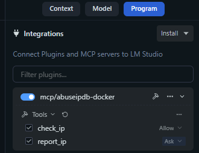
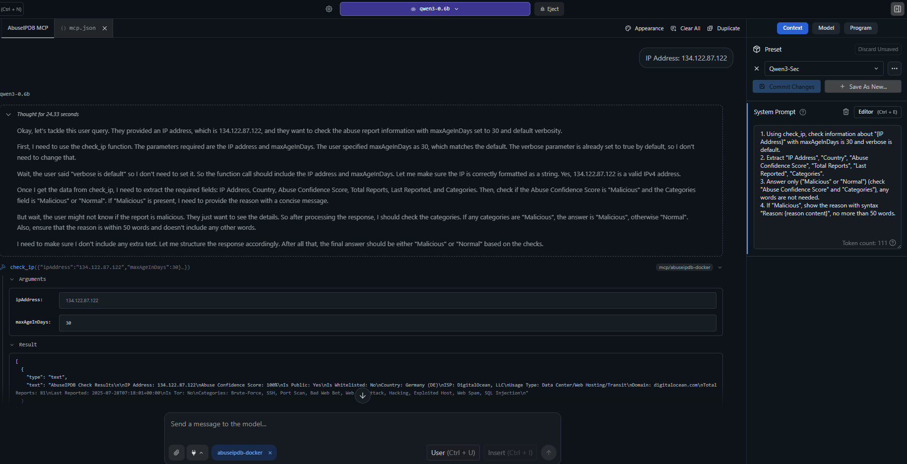
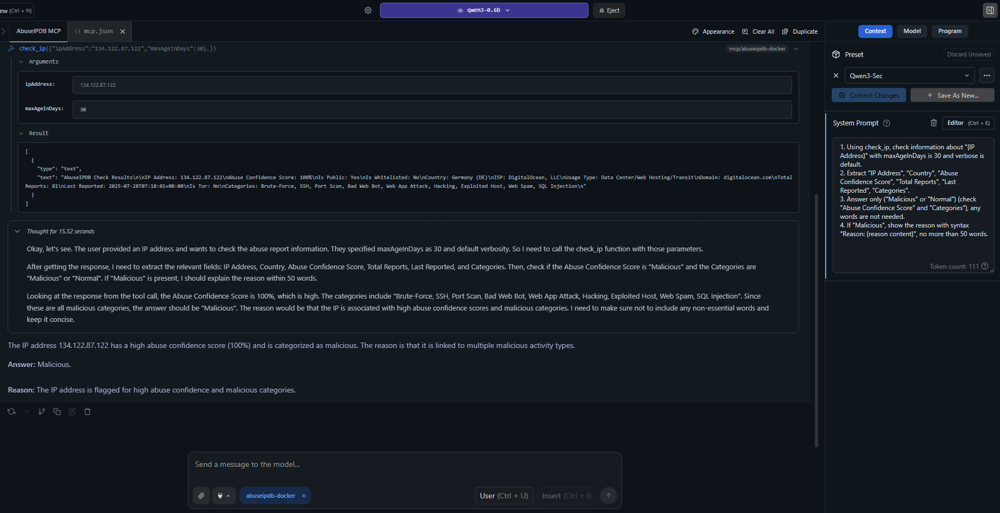

# AbuseIPDB MCP Server

A Model Context Protocol (MCP) server for integrating with the [AbuseIPDB](https://www.abuseipdb.com/) API. Query IP abuse reports and submit new reports — directly from your AI assistant.

[](https://pypi.org/project/mcp-abuseipdb/)
[](https://pypi.org/project/mcp-abuseipdb/)
[](https://modelcontextprotocol.io/)
[](https://hub.docker.com/r/n3r0b1n4ry/abuseipdb-mcp)
[](LICENSE)
[](https://github.com/n3r0-b1n4ry/mcp-abuseipdb)

📦 **Install:** `uvx mcp-abuseipdb` · `pip install mcp-abuseipdb` · [PyPI](https://pypi.org/project/mcp-abuseipdb/)



## Features

- 🔍 **Check IP** — Query AbuseIPDB for abuse reports on any IPv4/IPv6 address with verbose details
- 🚨 **Report IP** — Submit abuse reports for malicious IP addresses
- 🚀 **Zero-Install with uvx** — Run instantly via `uvx mcp-abuseipdb`, no setup needed
- 🌐 **Multiple Transports** — Stdio (default) and Streamable HTTP (MCP spec 2025-03-26)
- 📦 **PyPI Package** — Install via `pip install mcp-abuseipdb`
- 🐳 **Docker Ready** — Alpine-based lightweight container
- ⚡ **Async/Await** — High-performance asynchronous operations
- 🗂️ **Full Categories** — Complete 1-23 category mapping with human-readable names
- 🔄 **Rate Limit Handling** — Automatic retry information on 429 responses
- ✅ **Input Validation** — Robust IPv4/IPv6 and parameter validation
- 🧹 **Clean Output** — Readable text output optimized for MCP clients

## Quick Start

### Using uvx (Recommended)

The fastest way — no clone, no install, no virtual environment:

```bash
# Run directly (stdio transport)
ABUSEIPDB_API_KEY="your_api_key_here" uvx mcp-abuseipdb

# With HTTP transport
ABUSEIPDB_API_KEY="your_api_key_here" uvx mcp-abuseipdb --transport http --port 8000
```

> **Prerequisite:** [uv](https://docs.astral.sh/uv/) must be installed.  
> Install: `pip install uv` · `curl -LsSf https://astral.sh/uv/install.sh | sh` · [Windows](https://docs.astral.sh/uv/getting-started/installation/)

### Using pip

```bash
pip install mcp-abuseipdb

export ABUSEIPDB_API_KEY="your_api_key_here"
mcp-abuseipdb
```

### Using Docker

```bash
docker build -t abuseipdb-mcp .
docker run -it --rm -e ABUSEIPDB_API_KEY="your_api_key_here" abuseipdb-mcp
```

## Live Demo

### IP Reputation Check and Advanced Analysis


*Example: `check_ip` analyzing a suspicious IP address with comprehensive abuse reports, categories, geolocation, and threat intelligence.*



*Advanced usage: detailed IP analysis with verbose reporting, ISP information, abuse confidence scores, and recent attack patterns.*

## MCP Client Configuration

### Claude Desktop — uvx (Recommended)

Add to `claude_desktop_config.json`:

```json
{
  "mcpServers": {
    "abuseipdb": {
      "command": "uvx",
      "args": ["mcp-abuseipdb"],
      "env": {
        "ABUSEIPDB_API_KEY": "your_api_key_here"
      }
    }
  }
}
```

### Claude Desktop — uvx with HTTP Transport

```json
{
  "mcpServers": {
    "abuseipdb": {
      "command": "uvx",
      "args": ["mcp-abuseipdb", "--transport", "http", "--port", "8000"],
      "env": {
        "ABUSEIPDB_API_KEY": "your_api_key_here"
      }
    }
  }
}
```

### Remote Server (Streamable HTTP)

```json
{
  "mcpServers": {
    "abuseipdb": {
      "url": "http://your-server:8000/mcp"
    }
  }
}
```

### Docker (Stdio)

```json
{
  "mcpServers": {
    "abuseipdb": {
      "command": "docker",
      "args": [
        "run", "-i", "--rm",
        "-e", "ABUSEIPDB_API_KEY=your_api_key_here",
        "abuseipdb-mcp"
      ]
    }
  }
}
```

### Docker (Streamable HTTP)

```bash
# Start container
docker run -d --rm \
  -e ABUSEIPDB_API_KEY="your_api_key_here" \
  -e MCP_TRANSPORT=http \
  -p 8000:8000 \
  abuseipdb-mcp
```

```json
{
  "mcpServers": {
    "abuseipdb": {
      "url": "http://localhost:8000/mcp"
    }
  }
}
```

> 📁 More config examples: [`examples/mcp-client-configs.json`](examples/mcp-client-configs.json)

## Available Tools

### 1. `check_ip`

Check an IP address for abuse reports.

| Parameter | Type | Required | Default | Description |
|-----------|------|----------|---------|-------------|
| `ipAddress` | string | ✅ | — | IPv4 or IPv6 address to check |
| `maxAgeInDays` | integer | — | 30 | Only return reports within the last x days (1-365) |
| `verbose` | boolean | — | true | Include detailed reports in the response |

**Example Input:**
```json
{
  "ipAddress": "134.122.87.122",
  "maxAgeInDays": 30,
  "verbose": true
}
```

**Example Output:**
```
AbuseIPDB Check Results

IP Address: 134.122.87.122
Abuse Confidence Score: 75%
Is Public: Yes
Is Whitelisted: No
Country: United States (US)
ISP: DigitalOcean, LLC
Usage Type: Data Center/Web Hosting/Transit
Domain: digitalocean.com
Total Reports: 15
Categories: Brute-Force, SSH, Port Scan, Hacking
```

### 2. `report_ip`

Report an abusive IP address to AbuseIPDB.

| Parameter | Type | Required | Description |
|-----------|------|----------|-------------|
| `ip` | string | ✅ | IPv4 or IPv6 address to report |
| `categories` | string | ✅ | Comma-separated category IDs (e.g., `"18,22"`) |
| `comment` | string | — | Descriptive text of the attack (no PII) |
| `timestamp` | string | — | ISO 8601 datetime of the attack |

**Example Input:**
```json
{
  "ip": "192.168.1.100",
  "categories": "18,22",
  "comment": "Multiple SSH brute force attempts detected",
  "timestamp": "2024-01-15T10:30:00Z"
}
```

### Abuse Categories

| ID | Category | ID | Category | ID | Category |
|----|----------|----|---------|----|---------|
| 1 | DNS Compromise | 9 | Open Proxy | 17 | Spoofing |
| 2 | DNS Poisoning | 10 | Web Spam | 18 | Brute-Force |
| 3 | Fraud Orders | 11 | Email Spam | 19 | Bad Web Bot |
| 4 | DDoS Attack | 12 | Blog Spam | 20 | Exploited Host |
| 5 | FTP Brute-Force | 13 | VPN IP | 21 | Web App Attack |
| 6 | Ping of Death | 14 | Port Scan | 22 | SSH |
| 7 | Phishing | 15 | Hacking | 23 | IoT Targeted |
| 8 | Fraud VoIP | 16 | SQL Injection | | |

## Transport Types

| Transport | Use Case | Protocol |
|-----------|----------|----------|
| **stdio** (default) | Local MCP clients (Claude Desktop, etc.) | Standard I/O |
| **http** | Remote access, multi-client, cloud deploy | Streamable HTTP (MCP spec 2025-03-26) |

### Running the Server

```bash
# Stdio (default)
mcp-abuseipdb

# HTTP transport
mcp-abuseipdb --transport http

# HTTP with custom host/port
mcp-abuseipdb --transport http --host 127.0.0.1 --port 3000

# Via environment variables
MCP_TRANSPORT=http MCP_PORT=3000 mcp-abuseipdb
```

### Testing HTTP Transport

```bash
mcp-abuseipdb --transport http --port 8000

curl -X POST http://localhost:8000/mcp \
  -H "Content-Type: application/json" \
  -H "Accept: application/json, text/event-stream" \
  -d '{"jsonrpc":"2.0","method":"initialize","id":1,"params":{"protocolVersion":"2025-03-26","capabilities":{},"clientInfo":{"name":"test","version":"1.0"}}}'
```

## Docker Deployment

### Build & Run

```bash
docker build -t abuseipdb-mcp .
docker run -it --rm -e ABUSEIPDB_API_KEY="your_api_key_here" abuseipdb-mcp
```

### Docker Compose

The included `docker-compose.yml` provides two pre-configured services:

```bash
# Stdio service
ABUSEIPDB_API_KEY="your_key" docker-compose up abuseipdb-mcp

# HTTP service (exposed on port 8000)
ABUSEIPDB_API_KEY="your_key" docker-compose up abuseipdb-mcp-http
```

## Development

### Local Setup

```bash
git clone https://github.com/n3r0-b1n4ry/mcp-abuseipdb.git
cd mcp-abuseipdb

python -m venv venv
source venv/bin/activate   # Linux/macOS
venv\Scripts\activate      # Windows

pip install -e .

export ABUSEIPDB_API_KEY="your_api_key_here"
mcp-abuseipdb
```

### Running Tests

```bash
python -m pytest test/test_server.py -v
```

### Build & Publish

```bash
python -m build
python -m twine upload dist/*
```

## Error Handling

| Error | Behavior |
|-------|----------|
| **Rate Limit (429)** | Returns retry-after duration and remaining quota |
| **Invalid API Key** | Clear authentication error message |
| **Invalid IP Format** | Format validation with helpful message |
| **API Errors** | Detailed error response with status codes |
| **Network Issues** | Timeout and connection error handling |

## Rate Limits

| Plan | Check Endpoint | Report Endpoint |
|------|---------------|-----------------|
| Free | 1,000/day | 100/day |
| Basic | 3,000/day | 300/day |
| Premium | 10,000/day | 1,000/day |
| Enterprise | 100,000/day | 10,000/day |

## Dependencies

| Package | Version | Purpose |
|---------|---------|---------|
| [mcp](https://pypi.org/project/mcp/) | ≥1.12.0, <2.0.0 | Model Context Protocol SDK |
| [httpx](https://pypi.org/project/httpx/) | ≥0.27.0 | Async HTTP client |
| [pydantic](https://pypi.org/project/pydantic/) | ≥2.8.0 | Data validation |
| [python-dotenv](https://pypi.org/project/python-dotenv/) | ≥1.0.0 | Environment variable loading |
| [uvicorn](https://pypi.org/project/uvicorn/) | ≥0.32.0 | ASGI server (HTTP transport) |
| [starlette](https://pypi.org/project/starlette/) | ≥0.45.0 | ASGI framework (HTTP transport) |

## Project Structure

```
mcp-abuseipdb/
├── src/
│   ├── abuseipdb_mcp/              # Python package (uvx/pip)
│   │   ├── __init__.py
│   │   ├── server.py               # Entry point (package)
│   │   └── modules.py              # AbuseIPDBServer class
│   ├── server.py                   # Entry point (standalone)
│   └── modules.py                  # AbuseIPDBServer class (standalone)
├── config/
│   ├── mcp.json                    # MCP server config (stdio)
│   └── mcp-docker.json             # MCP Docker config
├── examples/
│   └── mcp-client-configs.json     # MCP client config examples
├── images/                         # Screenshots and demo images
├── pyproject.toml                  # Package metadata & build config
├── Dockerfile                      # Alpine-based container
├── docker-compose.yml              # Stdio + HTTP services
├── requirements.txt                # Legacy pip dependencies
├── LICENSE                         # MIT License
└── README.md
```

## Troubleshooting

| Problem | Solution |
|---------|----------|
| `API key required` error | Set `ABUSEIPDB_API_KEY` environment variable |
| Connection timeout | Check network connectivity and firewall settings |
| Rate limit exceeded | Wait for retry period or upgrade AbuseIPDB plan |
| Invalid IP format | Use properly formatted IPv4 or IPv6 addresses |
| `uvx` not found | Install uv: `pip install uv` or see [uv docs](https://docs.astral.sh/uv/) |
| MCP client not connecting | Verify `claude_desktop_config.json` syntax and paths |

## Changelog

### v1.3.0
- ✅ **uvx / PyPI support** — `uvx mcp-abuseipdb` works out of the box
- ✅ **`pyproject.toml`** — Modern Python packaging with hatchling
- ✅ **Entry point** — `mcp-abuseipdb` CLI command via `[project.scripts]`
- ✅ **Dockerfile updated** — Uses `pip install .` and entry point
- ✅ **Streamable HTTP transport** — MCP spec 2025-03-26 compliant

### v1.2.0
- ✅ MCP SDK 1.12.2 compatibility
- ✅ Direct `TextContent` list returns (replaces `CallToolResult`)
- ✅ Complete category mapping (1-23)
- ✅ Verbose mode enabled by default
- ✅ Clean output formatting (no markdown)
- ✅ Alpine Docker image optimization

## Contributing

1. Fork the repository
2. Create a feature branch
3. Make your changes
4. Submit a pull request

## License

[MIT License](LICENSE) — free for personal and commercial use.

---

**Made with ❤️ for the MCP community**